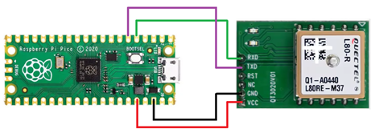

# Raspberry Pi Pico with Quectel L80-R GPS Module

This project demonstrates how to interface the **Quectel L80-R GPS module** with the **Raspberry Pi Pico** using UART communication. The Quectel L80-R GPS module is a compact, low-power GPS receiver, and the Raspberry Pi Pico is a microcontroller board based on the RP2040 chip, ideal for small embedded systems and IoT projects.

## Hardware Required

- **Raspberry Pi Pico** board (or any compatible RP2040-based board).
- **Quectel L80-R GPS module** (or L80RE-M37 variant).
- Jumper wires to connect the GPS module to the Pico.
- External power supply (if needed for GPS module).

## Circuit Connections

Here is how you should wire the Quectel L80-R GPS module to the Raspberry Pi Pico:

- Quectel L80-R TX (Transmit) → Raspberry Pi Pico RX (GPIO 3) (remapped to SPI0 RX on Pico).
- Quectel L80-R RX (Receive) → Raspberry Pi Pico TX (GPIO 4) (remapped to SPI0 TX on Pico).
- Quectel L80-R GND (Ground) → Raspberry Pi Pico GND.
- Quectel L80-R VCC (Power) → 3.3V or 5V power (depending on the GPS module's voltage requirements).

See: [L80-R Hardware Design](https://www.dragino.com/downloads/downloads/datasheet/other_vendors/L80-R/Quectel_L80-R_Hardware_Design_V1.2.pdf) 3.6. UART Interface



## Software Setup

This project is built using **C** and utilizes the Raspberry Pi Pico SDK. It includes basic functionality to receive GPS data via UART and display it through a serial monitor.

### 1. Setting up the Raspberry Pi Pico SDK

Follow these steps to set up the Raspberry Pi Pico SDK:

1. Install the **Raspberry Pi Pico SDK** by following the official guide:
   - [Raspberry Pi Pico SDK Setup Guide](https://www.raspberrypi.org/documentation/rp2040/getting-started/)

2. Install the necessary dependencies for building projects:
   - CMake
   - GCC toolchain for ARM (arm-none-eabi-gcc)
   - Minicom or any serial monitor tool for viewing the GPS data.

### 2. Clone the Project

Clone this repository to your local machine or development environment:

```bash
git clone https://github.com/yourusername/pico-gps-project.git
cd pico-gps-project
```

### 3. Build the Project

After setting up the Raspberry Pi Pico SDK and cloning the repository, build the project with the following commands:

```bash
mkdir build
cd build
cmake -G "Unix Makefiles" ..
make
```

## License

This project is licensed under the MIT License

